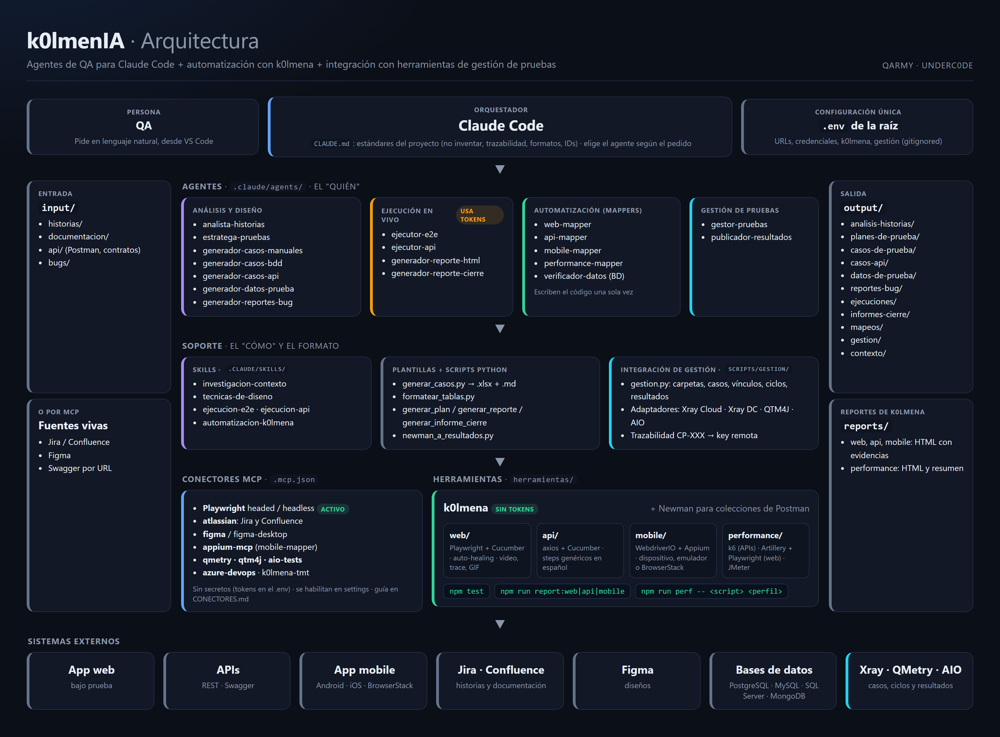
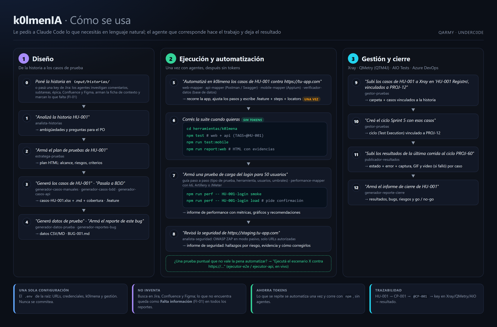

<div align="center">

# 🪖 k0lmenIA

### Agentes de QA para Claude Code

**Diseñá, ejecutá y automatizá pruebas conversando en español.**<br>
Análisis de historias, casos de prueba, automatización con k0lmena y gestión en Xray, QMetry, AIO Tests o Azure DevOps.

<br>

[](#licencia)
[](#)
[](#-agentes)
[](#️-automatización-con-k0lmena)
[](https://docs.claude.com/en/docs/claude-code/overview)

**Automatización**


**Stack**


**Bases de datos**


**Integraciones**


<br>

[**📖 Documentación web**](https://underc0delabs.github.io/k0lmenIA/) · [**📄 Documentación en PDF**](docs/k0lmenIA-documentacion.pdf) · [**🚀 Empezar**](#-instalación) · [**🌐 qarmy.ar**](https://qarmy.ar) · [**▶️ YouTube**](https://www.youtube.com/@QARMY-UC?sub_confirmation=1) · [**💬 WhatsApp**](https://whatsapp.com/channel/0029VaSzkgD1CYoTmiX8Uv26)

</div>

---

## ✨ Qué ofrece

> Pensado para QAs manuales: no hace falta programar. Se trabaja conversando con Claude Code dentro de VS Code.

|                                       |                                                                                                                                                                                       |
| ------------------------------------- | ------------------------------------------------------------------------------------------------------------------------------------------------------------------------------------- |
| 🧠 **Diseño de pruebas**              | Analiza historias, arma el plan, escribe casos manuales (Excel), BDD (Gherkin) y de API, genera datos y redacta bugs.                                                                 |
| 🤖 **Automatización sin tokens**      | Los agentes *mapper* recorren tu app **una sola vez** y escriben la automatización en k0lmena. Después corre con `npm test`, sin agentes.                                             |
| 🌐 **Web, API, mobile y performance** | Playwright + Cucumber, axios + Cucumber, WebdriverIO + Appium (dispositivo, emulador o BrowserStack), k6, Artillery y JMeter.                                                         |
| 📸 **Evidencia completa**             | Captura (y GIF) de cada test que pasa; video, logs, trace y error de cada test que falla, en reportes HTML.                                                                           |
| 🗂️ **Gestión de pruebas**             | Carpetas, casos, ciclos y resultados con evidencias en **Xray** (Cloud y Server/DC), **QMetry (QTM4J)** y **AIO Tests**; casos y suites en **Azure DevOps Test Plans**.               |
| 🗄️ **Verificación en base de datos**  | Revisa lo que dejaron guardado tus pruebas en **PostgreSQL, MySQL/MariaDB, SQL Server o MongoDB**, a pedido o, si lo pedís, como steps dentro de los tests. Solo lectura por defecto. |
| 🔌 **Conectado**                      | Lee historias de **Jira** o **Azure DevOps**, documentación de **Confluence** o de la Wiki de Azure DevOps y diseños de **Figma** por MCP.                                            |
| 🔎 **Investiga antes de suponer**     | Lee la historia de Jira con **todos sus comentarios, subtareas, épica e issues vinculados**, más Confluence y Figma, y arma una ficha de contexto.                                    |
| 🛡️ **No inventa**                     | Lo que no está en ninguna fuente queda marcado como **Falta información** (`FI-01`) en todos los reportes, con la pregunta para el PO.                                                |

<p align="center">
  
</p>

<p align="center">
  
</p>

---

## 📚 Contenido

- [Agentes](#-agentes)
- [Requisitos](#-requisitos)
- [Instalación](#-instalación)
- [Configuración: el archivo `.env`](#️-configuración-el-archivo-env)
- [Cómo se usa](#-cómo-se-usa)
- [Investigación de contexto y "Falta información"](#-investigación-de-contexto-y-falta-información)
- [Automatización con k0lmena](#️-automatización-con-k0lmena)
- [Pruebas de performance](#-pruebas-de-performance)
- [Gestión de pruebas: Xray, QMetry, AIO Tests y Azure DevOps](#️-gestión-de-pruebas-xray-qmetry-aio-tests-y-azure-devops)
- [Seguridad web](#️-seguridad-web)
- [Verificación en base de datos](#️-verificación-en-base-de-datos)
- [Conectores MCP](#-conectores-mcp)
- [Referencia](#-referencia): flujo completo, convenciones, estructura, problemas frecuentes y cómo extenderlo

---

## 🤖 Agentes

Claude Code elige el agente según lo que pidas; también podés nombrarlo (*"usá el web-mapper para…"*). **El catálogo completo** —cuándo usar cada agente, un pedido de ejemplo, qué skills, scripts, herramientas y conectores usa, qué entrega y qué te confirma antes— está en [`AGENTES.md`](AGENTES.md).

<table>
<tr><th>Familia</th><th>Agente</th><th>Qué hace</th></tr>
<tr><td rowspan="7"><b>🧠 Análisis<br>y diseño</b></td>
  <td><code>analista-historias</code></td><td>Investiga el contexto (comentarios, subtareas, épica, Confluence, Figma) y detecta ambigüedades, vacíos, riesgos y Falta información</td></tr>
<tr><td><code>estratega-pruebas</code></td><td>Plan de pruebas (alcance, riesgos, tipos, entorno, criterios) en HTML</td></tr>
<tr><td><code>generador-casos-manuales</code></td><td>Casos en Excel y Markdown + informe de cobertura</td></tr>
<tr><td><code>generador-casos-bdd</code></td><td>Escenarios Gherkin (keywords en inglés, contenido en español) + cobertura</td></tr>
<tr><td><code>generador-casos-api</code></td><td>Casos de API positivos, negativos, de schema y autorización</td></tr>
<tr><td><code>generador-datos-prueba</code></td><td>Datos válidos, inválidos y de borde (Markdown o CSV)</td></tr>
<tr><td><code>generador-reportes-bug</code></td><td>Reporte de bug según tu plantilla, con severidad y prioridad justificadas</td></tr>
<tr><td rowspan="4"><b>▶️ Ejecución<br>en vivo</b><br><sub>usa tokens</sub></td>
  <td><code>ejecutor-e2e</code></td><td>Ejecuta casos en un navegador real con Playwright MCP, con evidencia</td></tr>
<tr><td><code>ejecutor-api</code></td><td>Corre una colección de Postman con Newman</td></tr>
<tr><td><code>generador-reporte-html</code></td><td>Dashboard HTML de una ejecución</td></tr>
<tr><td><code>generador-reporte-cierre</code></td><td>Informe de cierre con recomendación go/no-go</td></tr>
<tr><td rowspan="6"><b>⚙️ Automatización<br>k0lmena</b><br><sub>después sin tokens</sub></td>
  <td><code>web-mapper</code></td><td>Recorre la web siguiendo tus casos y genera <code>.feature</code>, steps y locators</td></tr>
<tr><td><code>api-mapper</code></td><td>Lee Postman o Swagger/OpenAPI, verifica los endpoints y genera los <code>.feature</code></td></tr>
<tr><td><code>mobile-mapper</code></td><td>Recorre la app con Appium y genera <code>.feature</code>, steps y locators</td></tr>
<tr><td><code>performance-mapper</code></td><td>Carga, estrés, soak y picos con k6, Artillery o JMeter; pregunta carga y umbrales</td></tr>
<tr><td><code>verificador-datos</code></td><td>Verifica datos en PostgreSQL, MySQL/MariaDB, SQL Server o MongoDB y suma verificaciones de BD a los tests</td></tr>
<tr><td><code>analista-seguridad</code></td><td>Escaneo de seguridad web pasivo con OWASP ZAP e informe HTML con hallazgos, evidencia y cómo corregirlos</td></tr>
<tr><td rowspan="2"><b>🗂️ Gestión</b></td>
  <td><code>gestor-pruebas</code></td><td>Carpetas, casos, vínculos con la historia y ciclos en Xray, QMetry, AIO Tests o Azure DevOps</td></tr>
<tr><td><code>publicador-resultados</code></td><td>Sube los resultados de <code>npm test</code> al ciclo con sus evidencias</td></tr>
</table>

---

## 📋 Requisitos

| Para…                     | Necesitás                                                                                                 |
| ------------------------- | --------------------------------------------------------------------------------------------------------- |
| Usar los agentes          | **Claude Code** + cuenta de Claude (Pro, Max, Team o Enterprise) o API de Anthropic. VS Code recomendado. |
| Casos, reportes y gestión | **Python 3.10+** (`pip install -r requirements.txt`; en Mac/Linux, `pip3`)                                |
| Ejecutar E2E en vivo      | **Node.js 20+** (22 LTS recomendado) y navegadores de Playwright                                          |
| Colecciones de Postman    | **Newman**                                                                                                |
| Automatizar con k0lmena   | **Node.js 20+** (22 LTS recomendado; también lo piden los conectores de Azure DevOps y QMetry)            |
| Seguridad web (ZAP)       | **Docker** (Docker Desktop)                                                                               |
| Automatizar mobile        | **Node.js 22+**, JDK y Android SDK (o macOS con Xcode), o BrowserStack                                    |
| Performance con JMeter    | **Java 8+** (`npm run bootstrap:jmeter` descarga JMeter)                                                  |

---

## 🚀 Instalación

```bash
# 1. Claude Code (macOS / Linux; en Windows seguí la guía oficial, abajo)
curl -fsSL https://claude.ai/install.sh | bash

# 2. El repositorio (si ya lo tenés clonado con otro nombre, entrá a esa carpeta)
git clone https://github.com/underc0delabs/k0lmenIA.git
cd k0lmenIA
pip install -r requirements.txt   # en Mac/Linux: pip3 install -r requirements.txt
npm install                       # k0lmena (se instala en herramientas/k0lmena)
cp .env.example .env              # y completalo (en PowerShell: copy .env.example .env)

# 3. Revisá que esté todo listo
npm run doctor                    # dice qué falta y cómo resolverlo

# 4. A trabajar
code .
claude                            # en la terminal de VS Code
```

> En Windows el comando de Python es `python`; en Mac y Linux, `python3` y `pip3`. Si en Mac `pip3` responde *externally-managed-environment*, usá un entorno virtual: `python3 -m venv .venv && source .venv/bin/activate` (`.venv/` ya está en `.gitignore`).

<details>
<summary><b>Instalar lo opcional</b> (ejecución en vivo, Newman, k0lmena, k6)</summary>

```bash
npx playwright install                  # ejecución E2E en vivo
npm install -g newman                   # colecciones de Postman

npm install                             # k0lmena (desde la raíz; instala en herramientas/k0lmena)
cd herramientas/k0lmena
npx playwright install chromium
npm run bootstrap:k6                    # performance de APIs con k6
npm run bootstrap:jmeter                # performance con JMeter (necesita Java 8+)
```

Claude Code también se instala con `npm install -g @anthropic-ai/claude-code` (con Node.js 22 LTS cubrís Claude Code y todo el proyecto). Guía oficial: https://docs.claude.com/en/docs/claude-code/overview
</details>

---

## ⚙️ Configuración: el archivo `.env`

Hay **un solo `.env`, en la raíz**. Lo usan los agentes, k0lmena y los scripts de gestión. Nunca se sube al repo; la plantilla comentada es [`.env.example`](.env.example).

| Grupo                  | Variables                                                                                                                                   |
| ---------------------- | ------------------------------------------------------------------------------------------------------------------------------------------- |
| App bajo prueba        | `APP_URL` `APP_USER` `APP_PASSWORD`                                                                                                         |
| API                    | `API_TOKEN` `API_BASEURL`                                                                                                                   |
| Web (k0lmena)          | `BASEURL` `BROWSER` `HEADLESS` `VIEWPORT_WIDTH` `VIEWPORT_HEIGHT` `LOCALE` `TIMEZONE`                                                       |
| Ejecución y evidencias | `TAGS` `PARALLEL` `EVIDENCE` (`captura` · `ambos` · `off`) `VIDEO` `TRACE` `K0LMENA_AUTO_HEALING`                                           |
| Mobile                 | `MOBILE_TARGET` (`device` · `emulator` · `browserstack`) `MOBILE_PLATFORM` `MOBILE_DEVICE_NAME` `MOBILE_APP` `MOBILE_UDID` `BROWSERSTACK_*` |
| Performance            | `PERF_VUS` `PERF_DURACION` (opcionales)                                                                                                     |
| Bases de datos         | `DB_CONEXIONES` + por conexión `DB_<NOMBRE>_MOTOR` `_HOST` `_PUERTO` `_BASE` `_USUARIO` `_CLAVE` (o `_URL`) `_ESCRITURA` `_PRODUCCION`      |
| Gestión                | `GESTION_HERRAMIENTA` `GESTION_PROYECTO` + credenciales de Xray, QTM4J o AIO                                                                |
| Azure DevOps (MCP)     | `ADO_ORGANIZACION` `ADO_PAT` `ADO_PROYECTO`                                                                                                 |

> [!WARNING]
> Usá credenciales de un entorno de **prueba**. Los agentes leen los secretos del `.env`: nunca pegues un token en el chat.

---

## 💬 Cómo se usa

1. Poné tus insumos en `input/` (`historias/`, `documentacion/`, `api/`, `bugs/`), o pasá una key de Jira, una página de Confluence o un link de Figma.
2. Pedí lo que necesitás en lenguaje natural.
3. Revisá el resultado en `output/` o en `herramientas/k0lmena/`.

| Le pedís                                                                            | Obtenés                                                      |
| ----------------------------------------------------------------------------------- | ------------------------------------------------------------ |
| *"Investigá el contexto de PROJ-12"*                                                | Ficha de contexto con fuentes, hallazgos y Falta información |
| *"Analizá la historia HU-001"*                                                      | Ambigüedades y preguntas para el PO                          |
| *"Armá el plan de pruebas de HU-001"*                                               | Plan HTML                                                    |
| *"Generá los casos de HU-001"*                                                      | `casos-HU-001.xlsx` + `.md` + cobertura                      |
| *"Pasá la historia HU-001 a escenarios BDD"*                                        | `HU-001-<slug>.feature` + cobertura                          |
| *"Generá los casos de la API de autenticación"*                                     | Casos de API con sus JSON                                    |
| *"Tomá la observación de input/bugs/ y armá el reporte"*                            | `BUG-001.md`                                                 |
| *"Ejecutá el escenario de registro válido contra https://tu-app.com"*               | Reporte HTML de la corrida con evidencia                     |
| *"Automatizá en k0lmena los casos de HU-001 contra https://tu-app.com"*             | `.feature` + steps + locators                                |
| *"Armá una prueba de carga del login para 20 usuarios"*                             | Script k6/Artillery/JMeter + reporte HTML                    |
| *"Verificá en la base si se creó el usuario ana@test.com y en qué estado quedó"*    | Consulta y resultado (solo lectura)                          |
| *"Sumá al test de registro la verificación en la base de datos"*                    | Steps de BD en el `.feature`                                 |
| *"Subí los casos de HU-001 a Xray, vinculados a PROJ-12, y creá el ciclo Sprint 5"* | Casos y ciclo en Xray                                        |
| *"Subí los resultados de la última corrida al ciclo PROJ-60"*                       | Estados y evidencias en el ciclo                             |
| *"Armá el informe de cierre de HU-001"*                                             | Resultados, bugs y go/no-go                                  |

---

## 🔎 Investigación de contexto y "Falta información"

Antes de analizar, planificar, escribir casos o automatizar una historia, los agentes **investigan su contexto completo** (skill `investigacion-contexto`) en lugar de suponer:

| Fuente                               | Qué revisan                                                                                                      |
| ------------------------------------ | ---------------------------------------------------------------------------------------------------------------- |
| Historia de Jira                     | Descripción, criterios, estado, labels, componentes y adjuntos                                                   |
| Comentarios                          | **Todos**: las decisiones que se tomaron después (*"acordamos que el límite es 50"*) reemplazan a la descripción |
| Subtareas, épica e issues vinculados | Reglas generales, historias hermanas y bugs conocidos del flujo                                                  |
| Confluence y Figma                   | Páginas enlazadas o relacionadas; textos exactos, mensajes y estados del diseño                                  |
| Contratos y `input/`                 | Swagger, Postman y documentación local                                                                           |

El resultado es una **ficha de contexto** reutilizable (`output/contexto/contexto-HU-XXX.md`) con las fuentes consultadas, los hallazgos por criterio, las decisiones y las contradicciones. Si la historia no cambió, los demás agentes la reusan sin volver a investigar.

**Lo que no aparece en ninguna fuente se marca como "Falta información"** con un ID por historia (`FI-01`, `FI-02`, …), que viaja a todos los reportes:

| Dónde                              | Cómo se ve                                                                                                                            |
| ---------------------------------- | ------------------------------------------------------------------------------------------------------------------------------------- |
| Planilla de casos (`.xlsx`)        | Casos resaltados en ámbar, etiqueta `@falta-info`, detalle en Comentarios y hoja **Falta información**                                |
| Coberturas y análisis              | Sección **Falta información** (qué falta, dónde se buscó, a qué afecta, pregunta para el PO); criterios `Parcial (falta información)` |
| `.feature` de k0lmena              | Tags `@falta-info @FI-01` y comentario `# FALTA INFORMACIÓN (FI-01): …`                                                               |
| Reporte de mapeo                   | Estado `Falta información`: el mapper **no usa la app para completar el dato**                                                        |
| Reportes de k0lmena y de ejecución | Nota visible en el escenario y aviso en el resumen                                                                                    |
| Informe de cierre                  | Sección **Falta información** con los ítems abiertos como riesgo                                                                      |
| Xray · QMetry · AIO                | El comentario del resultado aclara que el caso depende de información faltante                                                        |

> *"Investigá el contexto de PROJ-12 y generá los casos"* → ficha de contexto + casos, con lo que falte marcado y las preguntas listas para el PO.

---

## ⚙️ Automatización con k0lmena

[k0lmena](https://github.com/underc0delabs/k0lmena) vive en `herramientas/k0lmena/`. Los agentes *mapper* verifican tus casos contra la app real y escriben la automatización **una sola vez**; después la suite corre las veces que quieras, **sin tokens**. Las carpetas vienen vacías: todo lo generan los mappers para tu aplicación.

Los comandos se pueden correr desde la raíz del repo (el `package.json` de la raíz los delega a k0lmena) o dentro de `herramientas/k0lmena`:

```bash
npm test                          # web + API
npm run test:web                  # también: test:api · test:mobile · test:all
TAGS=@HU-001 npm test             # filtrar por tag (PowerShell: $env:TAGS="@HU-001"; npm test)
npm run report:web                # reporte HTML (también: report:api · report:mobile)
```

| Suite     | Test que pasa                               | Test que falla                                                                    |
| --------- | ------------------------------------------- | --------------------------------------------------------------------------------- |
| 🌐 Web    | Captura final (+ GIF opcional)              | Video completo, captura, error, logs del navegador y de Node, trace de Playwright |
| 🔗 API    | Request y response (`Authorization` oculto) | Lo mismo + la validación que falló                                                |
| 📱 Mobile | Captura final (+ GIF opcional)              | Video completo, captura, page source y logs del dispositivo                       |

- `@bloqueado`: escenario con un paso que el mapper no pudo verificar; no se ejecuta hasta que se resuelva.
- Mobile corre en `device`, `emulator` o `browserstack` según `MOBILE_TARGET`; el mobile-mapper necesita el conector Appium MCP.
- Extras: `npm run crawler`, `npm run link-tester`, `npm run record`, `npm run debug` y auto-healing de locators.

Detalle en [`herramientas/k0lmena/README.md`](herramientas/k0lmena/README.md).

---

## ⚡ Pruebas de performance

Pedí algo como *"quiero hacer una prueba de carga del login"* y Claude te **guía paso a paso**, con una pregunta por vez y una sugerencia justificada en cada una:

1. **Objetivo y tipo de prueba**: qué querés averiguar y qué prueba lo responde (load, stress, soak, spike).
2. **Herramienta**: **k6** (APIs), **Artillery + Playwright** (flujos en el navegador) o **JMeter** (si tu equipo ya lo usa, traés un `.jmx` o necesitás otros protocolos), con una recomendación y su porqué.
3. **Ambiente y alcance**: URL (nunca producción sin autorización), endpoints o pasos y su peso.
4. **Carga**: usuarios concurrentes, rampa, duración y tiempo de pensamiento. Si no sabés cuántos usuarios, te ayuda a calcularlos desde el volumen de negocio.
5. **Umbrales**: p95, p99 y % de error, desde el requisito o con valores de referencia que confirmás.
6. **Plan**: lo resume en `output/performance/<HU>/` y te pide confirmación.

Después, el **performance-mapper** escribe el script, lo valida con un smoke, corre cada prueba con carga **solo cuando la confirmás** y arma el **informe de performance**: dashboard HTML con veredicto, capacidad observada, métricas por corrida, gráficos de latencia, throughput, errores y evolución en el tiempo, umbrales, p95 por endpoint, hallazgos y **recomendaciones**. Las tres herramientas usan los mismos perfiles y el mismo formato de reporte.

```bash
npm run perf                                   # lista los scripts
npm run perf -- <script> smoke                 # valida el script
npm run perf -- <script> load                  # carga objetivo (pide confirmación)
npm run perf -- <script> stress --confirmar    # CI o con autorización previa
```

| Perfil   | Qué hace                                       |
| -------- | ---------------------------------------------- |
| `smoke`  | Carga mínima: valida que el script funciona    |
| `load`   | Sostiene la carga objetivo                     |
| `stress` | 1x, 2x y 3x: busca el punto de quiebre         |
| `soak`   | Larga duración: fugas de memoria y degradación |
| `spike`  | Pico brusco y recuperación                     |

Cada corrida deja además su propio **reporte HTML** en `herramientas/k0lmena/reports/performance/` con veredicto, latencias p50/p95/p99, errores, umbrales y detalle por endpoint. Si un umbral no se cumple, el comando termina con error. Los scripts quedan versionados: volvés a correrlos con `npm run perf`, sin agentes ni tokens.

> [!CAUTION]
> Una prueba de carga genera tráfico real: corrédla solo contra ambientes de prueba o con autorización.

---

## 🗂️ Gestión de pruebas: Xray, QMetry, AIO Tests y Azure DevOps

Configurá `GESTION_HERRAMIENTA` (`xray-cloud` · `xray-dc` · `qtm4j` · `aio`), `GESTION_PROYECTO` y las credenciales en el `.env`, y pedí:

- *"Subí los casos de HU-001 a Xray en la carpeta 'HU-001 Registro', vinculados a PROJ-12"* → **gestor-pruebas** crea la carpeta, sube los casos y los vincula a la historia.
- *"Creá el ciclo Sprint 5 con esos casos"* → crea el ciclo (Test Execution en Xray) vinculado a la historia.
- *"Subí los resultados de la última corrida al ciclo PROJ-60"* → **publicador-resultados** carga estado, error y evidencias (captura, GIF y video si falló).

La trazabilidad (`output/gestion/<HU>-<herramienta>.json`) evita duplicados. También hay comandos manuales: [`scripts/gestion/README.md`](scripts/gestion/README.md).

### Azure DevOps (Test Plans)

Azure DevOps se integra por su conector MCP oficial (`azure-devops`), con `ADO_ORGANIZACION`, `ADO_PAT` y `ADO_PROYECTO` en el `.env` (ver [`CONECTORES.md`](CONECTORES.md#azure-devops)):

- *"Leé la historia 1234 de Azure DevOps y analizala"* → los agentes leen el work item con sus comentarios, tareas, padre, vínculos y la Wiki.
- *"Subí los casos de `casos-HU-001.xlsx` a Azure Test Plans, plan 'Sprint 5', suite 'HU-001 Registro', vinculados a la historia 1234"* → **gestor-pruebas** convierte los pasos con `scripts/gestion/para_azure_devops.py`, crea los *Test Cases*, los vincula a la historia y los agrega a la suite.

Por ahora el conector no registra resultados de ejecución: **publicador-resultados** todavía no publica en Azure DevOps.

---

## 🛡️ Seguridad web

El **analista-seguridad** revisa la seguridad de tu aplicación con **OWASP ZAP** (libre y gratuito) en modo **pasivo**: recorre el sitio y analiza las respuestas sin enviar ataques ni modificar datos. Encuentra encabezados de seguridad faltantes, cookies inseguras, información expuesta, contenido mixto y otras configuraciones débiles.

1. Declará en el `.env` los sitios que podés escanear (propios o con autorización por escrito): `SEGURIDAD_URLS_AUTORIZADAS=https://staging.mi-app.com`
2. Abrí **Docker Desktop** (ZAP corre en un contenedor).
3. Pedí: *"Revisá la seguridad de https://staging.mi-app.com para HU-001"*.

El agente te confirma la URL, corre el escaneo, analiza los hallazgos (prioriza, descarta falsos positivos y los explica en español) y genera el **informe de seguridad** en HTML: hallazgos por riesgo, dónde aparece cada uno, evidencia, cómo se corrige y recomendaciones priorizadas. Queda en `output/seguridad/`. Detalle en [`herramientas/zap/README.md`](herramientas/zap/README.md).

> [!IMPORTANT]
> Solo se escanean sitios autorizados en el `.env`, y nunca en modo activo. Un escaneo pasivo sin hallazgos no garantiza que el sitio sea seguro: no reemplaza una prueba de penetración.

---

## 🗄️ Verificación en base de datos

El **verificador-datos** se conecta a las bases configuradas en el `.env` (**PostgreSQL, MySQL / MariaDB, SQL Server y MongoDB**, con varias conexiones con nombre) y verifica lo que necesites: qué guardó un test web o de API, si existe un dato, en qué estado quedó un registro.

- *"Verificá en la base si existe el usuario ana@test.com y en qué estado quedó"*
- *"Revisá qué guardó en pedidos el test HU-003"*
- *"Sumá al escenario de registro la verificación en la base de datos"* → steps que después corren con `npm test`, sin tokens:

```gherkin
When envío un POST a "/usuarios" con el body: ...
And guardo el campo "id" de la respuesta como "idUsuario"
Then el registro de "usuarios" donde "id" es "{idUsuario}" tiene:
  | campo  | valor  |
  | estado | ACTIVO |
```

> [!NOTE]
> **Las verificaciones de base de datos se agregan a los tests solo cuando lo pedís.** Los mappers (web, API y mobile) no las suman por su cuenta: si un caso menciona datos guardados, lo dejan como sugerencia en el reporte de mapeo. Y el verificador-datos, ante una consulta puntual, responde sin tocar los `.feature`.

> [!IMPORTANT]
> **Solo lectura por defecto**: las consultas corren en transacciones de solo lectura que se descartan, y las columnas sensibles (contraseñas, tokens, tarjetas) se enmascaran. Para preparar o limpiar datos, la conexión necesita `DB_<NOMBRE>_ESCRITURA=si` y el agente pide confirmación antes de cada operación; con `DB_<NOMBRE>_PRODUCCION=si` nunca escribe. Recomendado: un usuario de base de datos con permisos de solo lectura.

También se usa sin agente: `npm run bd -- conexiones | esquema | existe | consultar` en `herramientas/k0lmena/`.

---

## 🔌 Conectores MCP

| Conector                         | Para qué                                                    | Autenticación                                     |
| -------------------------------- | ----------------------------------------------------------- | ------------------------------------------------- |
| `playwright`                     | Navegador para el ejecutor E2E y el web-mapper              | Activo por defecto                                |
| `atlassian`                      | **Jira y Confluence**: historias, criterios y documentación | Activo por defecto: tu cuenta (OAuth) o API token |
| `figma` · `figma-desktop`        | Diseños desde un link a un frame o archivo                  | Tu cuenta (OAuth)                                 |
| `appium-mcp`                     | Recorrer la app para el mobile-mapper                       | `ANDROID_HOME`                                    |
| `qmetry` · `qtm4j` · `aio-tests` | Consultar la herramienta de gestión desde el chat           | API key / token                                   |
| `azure-devops`                   | **Azure DevOps**: historias, Wiki y casos en Test Plans     | PAT                                               |
| `k0lmena-tmt`                    | Cargar y consultar casos en k0lmenaTMT                      | Token personal                                    |

Claude Code arranca directo, sin pedir aprobar conectores: vienen activos Playwright y Atlassian (Jira y Confluence). Los demás los activa cada QA según su equipo, con un comando. Ninguno lleva secretos: las credenciales se leen del `.env`, que trae un bloque comentado por herramienta. Guía completa en [`CONECTORES.md`](CONECTORES.md).

---

**Activar un conector** (por ejemplo, Azure DevOps):

```bash
npm run conector                            # lista los conectores y cuáles tenés activos
npm run conector -- activar azure-devops    # queda solo para vos; reiniciá Claude Code
```

`npm run doctor` te dice qué variables le faltan a cada conector activo. Detalle por herramienta en [`CONECTORES.md`](CONECTORES.md#qué-configurar-según-tu-equipo).

---

## 📎 Referencia

<details>
<summary><b>Un flujo completo, de punta a punta</b></summary>

```
0. "Investigá el contexto de PROJ-12"                  → ficha de contexto + Falta información (FI-XX)
1. "Analizá HU-001"                                    → preguntas para el PO
2. "Armá el plan de pruebas de HU-001"                 → plan HTML
3. "Generá los casos de HU-001"                        → casos-HU-001.xlsx + cobertura
4. "Subí los casos a Xray y creá el ciclo Sprint 5"    → casos y ciclo en Xray
5. "Automatizá en k0lmena los casos de HU-001"         → .feature + steps + locators
6. npm test · npm run report:web                       → reporte con evidencias (sin tokens)
7. "Subí los resultados al ciclo del Sprint 5"         → estados y evidencias en Xray
8. "Armá una prueba de carga del login"                → script + reporte de performance
9. "Armá el informe de cierre de HU-001"               → go / no-go
```
</details>

<details>
<summary><b>Convenciones</b></summary>

| Elemento                | Formato                                                                                           |
| ----------------------- | ------------------------------------------------------------------------------------------------- |
| Historias · criterios   | `HU-001` · `CA1`                                                                                  |
| Casos manuales · de API | `CP-001` · `CP-API-001`                                                                           |
| Bugs                    | `BUG-001`                                                                                         |
| Falta información       | `FI-01` (por historia) · tags `@falta-info @FI-01`                                                |
| Severidad y prioridad   | Crítica · Alta · Media · Baja                                                                     |
| Estado de un caso       | N/A · Pendiente · En ejecución · Aprobado · Fallido · Bloqueado                                   |
| Tags en k0lmena         | Feature: `@HU-001 @web` · Scenario: `@CP-001` (`@smoke` si es crítico) · `@bloqueado`             |
| Automatización          | `<tipo>/features/HU-001-<slug>.feature` · `steps/HU-001.steps.ts` · `locators/HU-001.locators.ts` |
</details>

<details>
<summary><b>Estructura del repositorio</b></summary>

```
k0lmenIA/
├── CLAUDE.md               Contexto y estándares (Claude Code lo lee siempre)
├── AGENTES.md              Catálogo de agentes: skills, herramientas, conectores y salidas
├── ARQUITECTURA.md         Cómo crece el repo
├── CONECTORES.md           Cómo activar los conectores MCP
├── CHANGELOG.md            Cambios de cada versión
├── LICENSE                 Licencia MIT
├── .env.example            Plantilla de variables (copiar a .env)
├── .mcp.json               Conectores MCP (sin secretos; activos según settings)
├── package.json            Atajos para correr k0lmena desde la raíz (npm test…)
├── docs/                   Documentación web, PDF y diagramas
├── tests/                  Tests de los scripts del repo (pytest y node --test)
├── .github/workflows/      CI: los tests en Ubuntu y Windows
├── .claude/
│   ├── agents/             Los 19 agentes
│   ├── skills/             Contexto, diseño, guía de performance, ejecución E2E y API, k0lmena
│   └── settings.json       Conectores habilitados y permisos del proyecto
├── input/                  historias/ documentacion/ api/ bugs/ (ver input/README.md)
├── output/                 Lo que generan los agentes (contexto/, casos, reportes, mapeos…)
├── plantillas/             Bug, planilla de casos, cobertura
├── scripts/                Casos, reportes HTML, informes, Newman, recolector y doctor
│   ├── gestion/            Xray, QMetry (QTM4J), AIO Tests y casos para Azure DevOps
│   └── mcp/                Lanzadores de los conectores MCP (leen el .env)
└── herramientas/
    ├── newman/             Colecciones de Postman
    ├── zap/                OWASP ZAP: seguridad web (escaneo pasivo)
    └── k0lmena/            web/ api/ mobile/ performance/ reports/
```
</details>

<details>
<summary><b>Problemas frecuentes</b></summary>

| Problema                                                          | Solución                                                                                                                  |
| ----------------------------------------------------------------- | ------------------------------------------------------------------------------------------------------------------------- |
| Un agente nuevo no aparece                                        | Reiniciá Claude Code.                                                                                                     |
| La suite web falla con viewport 0x0 o sin URL                     | Falta el `.env` de la raíz: `cp .env.example .env` y completalo.                                                          |
| `npm test` corre 0 escenarios                                     | Todavía no automatizaste nada o `TAGS` no coincide.                                                                       |
| Un escenario nunca se ejecuta                                     | Tiene `@bloqueado`; el motivo está en un comentario arriba.                                                               |
| "No encuentro k6"                                                 | `npm run bootstrap:k6` en `herramientas/k0lmena/`.                                                                        |
| "No encuentro JMeter" / "JMeter necesita Java"                    | `npm run bootstrap:jmeter` (o `JMETER_HOME`) e instalá Java 8+ en el PATH (o `JAVA_HOME`).                                |
| `npm run perf` no corre un perfil con carga desde el agente       | Es a propósito: necesita `--confirmar`, que el agente agrega tras tu confirmación.                                        |
| Una carpeta de Xray/QMetry/AIO sale como `C:/Program Files/Git/…` | En Git Bash escribí las carpetas sin `/` inicial.                                                                         |
| ¿Los tests verifican la base de datos siempre?                    | No: las verificaciones de BD se agregan a un `.feature` solo cuando las pedís; sin `DB_CONEXIONES`, la suite corre igual. |
| Un conector MCP no conecta                                        | Corré `npm run doctor`: dice qué variable falta en el `.env`. Atlassian y Figma se autorizan desde `/mcp`.                |
| No sé qué me falta instalar                                       | `npm run doctor` revisa Python, Node, k0lmena, Playwright, Newman, Java, Docker, el `.env` y los conectores.              |
| Un agente devuelve "Necesito que confirmes"                       | Es a propósito: los agentes no pueden preguntar a mitad del trabajo. Respondé y Claude lo continúa.                       |
</details>

<details>
<summary><b>Cómo extender el proyecto</b></summary>

- **Agente**: un `.md` en `.claude/agents/` con `name` y `description` (es lo que usa Claude Code para decidir cuándo invocarlo) y el cuerpo en español: rol, entradas, proceso, salida y reglas.
- **Skill**: una carpeta en `.claude/skills/` con su `SKILL.md`.
- **Conector**: una entrada en `.mcp.json`, sin secretos; los tokens se leen del `.env` con un script de `scripts/mcp/`.
- **Herramienta**: una subcarpeta en `herramientas/` con su README.
- **Tests del repo**: `python -m pytest tests` y `npm run test:repo` (corren también en CI, en Ubuntu y Windows). Sumá un test cuando cambies un script.
- **Documentación**: el sitio es [`docs/index.html`](docs/index.html), publicado en https://underc0delabs.github.io/k0lmenIA/ (GitHub Pages desde `docs/`); `node docs/generar.js` regenera los diagramas y el PDF.

Más detalle en [`ARQUITECTURA.md`](ARQUITECTURA.md).
</details>

---

## Licencia

**MIT** — © 2026 **QARMY**. Podés usarlo, modificarlo y compartirlo libremente; se entrega sin garantías. k0lmena es un proyecto open source de **Danilo Vezzoni**.

<div align="center">
<br>
Hecho con 🪖 por la comunidad de <b>Underc0de</b>
</div>
