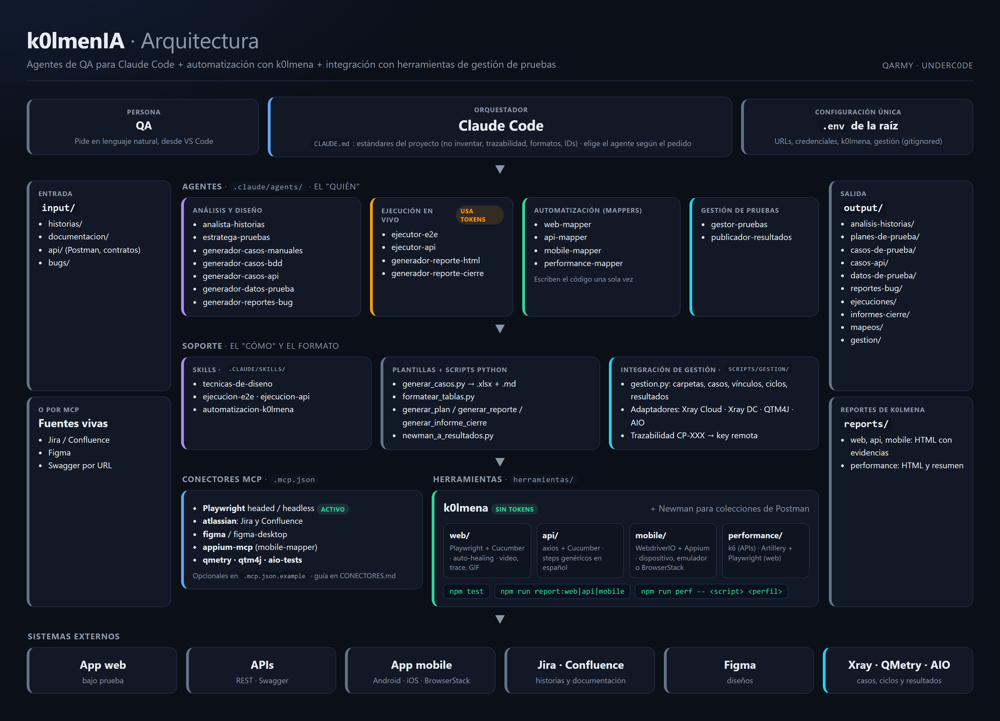
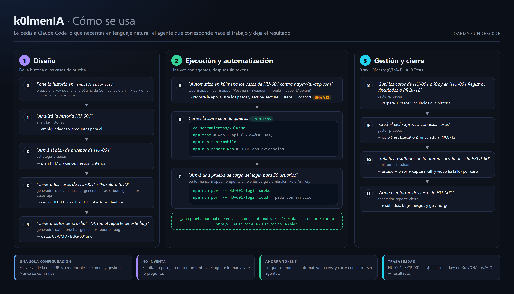

# 🪖 k0lmenIA

**Agentes de QA para Claude Code** que aceleran el día a día del testing: analizar historias, planificar, escribir casos de prueba (manuales, BDD y de API), generar datos, redactar bugs, ejecutar pruebas, **automatizarlas con [k0lmena](https://github.com/underc0delabs/k0lmena)** (web, API, mobile y performance) y llevar todo a **Xray, QMetry o AIO Tests** — todo en español.

> Pensado para QAs manuales. No hace falta saber programar: se trabaja conversando con Claude Code dentro de VS Code. La automatización la escriben los agentes **una sola vez** y después corre sola con `npm test`, **sin gastar tokens**.

🌐 Web: https://qarmy.ar · ▶️ YouTube: https://www.youtube.com/@QARMY-UC?sub_confirmation=1 · 💬 WhatsApp: https://whatsapp.com/channel/0029VaSzkgD1CYoTmiX8Uv26

---

## Índice

1. [¿Qué es esto?](#qué-es-esto)
2. [Agentes disponibles](#agentes-disponibles)
3. [Requisitos](#requisitos)
4. [Instalación](#instalación)
5. [Configuración: el archivo `.env`](#configuración-el-archivo-env)
6. [Cómo se usa](#cómo-se-usa)
7. [Guía por tarea: diseño y ejecución manual](#guía-por-tarea-diseño-y-ejecución-manual)
8. [Automatización con k0lmena](#automatización-con-k0lmena)
9. [Pruebas de performance](#pruebas-de-performance)
10. [Gestión de pruebas: Xray, QMetry y AIO Tests](#gestión-de-pruebas-xray-qmetry-y-aio-tests)
11. [Conectores MCP](#conectores-mcp)
12. [Un flujo completo, de punta a punta](#un-flujo-completo-de-punta-a-punta)
13. [Convenciones](#convenciones)
14. [Estructura del repositorio](#estructura-del-repositorio)
15. [Problemas frecuentes](#problemas-frecuentes)
16. [Cómo agregar un agente nuevo](#cómo-agregar-un-agente-nuevo)

---

## ¿Qué es esto?

Un repositorio con un equipo de **agentes especializados en QA** para [Claude Code](https://docs.claude.com/en/docs/claude-code/overview). Vos ponés un insumo (una historia, una observación de bug, un contrato de API) en `input/`, le pedís a Claude Code lo que necesitás en lenguaje natural, y el agente que corresponde genera el resultado en `output/`.

```
input/ ──► [ agente de QA ] ──► output/
                 ▲
       plantillas/ + scripts/   (formato de cada entregable)
```

> 📄 **Documentación completa en PDF:** [`docs/k0lmenIA-documentacion.pdf`](docs/k0lmenIA-documentacion.pdf)





El trabajo se organiza en tres etapas, y podés usar solo las que necesites:

```
 1. DISEÑO                      2. AUTOMATIZACIÓN (k0lmena)            3. GESTIÓN
 historia ─► análisis           casos ─► *-mapper ─► .feature/steps    casos y ciclos ─► Xray / QMetry / AIO
         ─► plan de pruebas                         (una sola vez)     resultados de npm test ─► ciclo
         ─► casos (xlsx / BDD)  npm test / npm run perf  (sin tokens)
         ─► datos, bugs         reportes HTML con evidencias
```

---

## Agentes disponibles

Claude Code elige el agente según lo que pidas; también podés nombrarlo explícitamente (*"usá el web-mapper para…"*).

**Análisis y diseño**

| Agente | Qué hace | Salida |
|--------|----------|--------|
| 🔍 `analista-historias` | Analiza historias y criterios de aceptación: ambigüedades, vacíos, riesgos y preguntas de refinamiento | `output/analisis-historias/` |
| 🗺️ `estratega-pruebas` | Plan de pruebas (alcance, riesgos, tipos de prueba, entorno, criterios de entrada y salida) como dashboard HTML | `output/planes-de-prueba/` |
| 📝 `generador-casos-manuales` | Casos de prueba en Excel y Markdown + informe de cobertura con preguntas para el PO | `output/casos-de-prueba/manuales/` |
| 🥒 `generador-casos-bdd` | Escenarios Gherkin (keywords en inglés, contenido en español) + cobertura por criterio | `output/casos-de-prueba/bdd/` |
| 🔌 `generador-casos-api` | Casos de API (positivos, negativos, schema y autorización) a partir de un contrato | `output/casos-api/` |
| 🎲 `generador-datos-prueba` | Datos realistas: válidos, inválidos y de borde (Markdown o CSV) | `output/datos-de-prueba/` |
| 🐞 `generador-reportes-bug` | Convierte notas sueltas en un reporte de bug profesional según tu plantilla | `output/reportes-bug/` |

**Ejecución en vivo** (gastan tokens en cada corrida: para pruebas que se repiten, automatizalas con k0lmena)

| Agente | Qué hace | Salida |
|--------|----------|--------|
| ▶️ `ejecutor-e2e` | Ejecuta casos o escenarios en un navegador real con Playwright MCP (headed o headless), con evidencia | `output/ejecuciones/` |
| 🧪 `ejecutor-api` | Corre una colección de Postman con Newman | `output/ejecuciones/` |
| 📊 `generador-reporte-html` | Dashboard HTML de los resultados de una ejecución | `output/ejecuciones/` |
| 🏁 `generador-reporte-cierre` | Informe de cierre de la ronda (resultados, bugs, go/no-go) en HTML | `output/informes-cierre/` |

**Automatización con k0lmena** (escriben el código una vez; después corre con `npm`, sin tokens)

| Agente | Qué hace | Salida |
|--------|----------|--------|
| 🧭 `web-mapper` | Recorre la web siguiendo tus casos y genera `.feature`, steps y locators | `herramientas/k0lmena/web/` |
| 🛰️ `api-mapper` | Lee un Postman o un Swagger/OpenAPI, verifica los endpoints y genera los `.feature` de API | `herramientas/k0lmena/api/` |
| 📱 `mobile-mapper` | Recorre la app (Appium) siguiendo tus casos y genera `.feature`, steps y locators | `herramientas/k0lmena/mobile/` |
| ⚡ `performance-mapper` | Pruebas de carga, estrés, soak y picos con k6 (APIs) o Artillery + Playwright (web); pregunta la carga y los umbrales | `herramientas/k0lmena/performance/` |

**Gestión de pruebas**

| Agente | Qué hace | Salida |
|--------|----------|--------|
| 🗂️ `gestor-pruebas` | Crea carpetas y casos en Xray, QMetry (QTM4J) o AIO Tests, los vincula a la historia, crea ciclos y les agrega casos | La herramienta + `output/gestion/` |
| 📤 `publicador-resultados` | Sube los resultados de `npm test` al ciclo: estado, error y evidencias (captura, GIF, video si falló) | La herramienta |

---

## Requisitos

| Para… | Necesitás |
|-------|-----------|
| Usar los agentes | **Claude Code** y una cuenta de Claude (plan **Pro**, **Max**, **Team** o **Enterprise**) o acceso por **API** de Anthropic. El plan gratuito no incluye Claude Code. |
| Editar y conversar | **VS Code** (recomendado; Claude Code también corre en cualquier terminal) |
| Generar casos, reportes y usar la gestión de pruebas | **Python 3** con `openpyxl`, `tabulate` y `requests` (`pip install -r requirements.txt`) |
| Ejecutar E2E en vivo | **Node.js 18+** y los navegadores de Playwright (`npx playwright install`) |
| Ejecutar API con Newman | **Newman** (`npm install -g newman`) |
| Automatizar con k0lmena (web, API, performance) | **Node.js 20+** |
| Automatizar mobile | **Node.js 22+**, JDK, Android SDK (`ANDROID_HOME`) o macOS con Xcode para iOS; o una cuenta de BrowserStack |

---

## Instalación

### 1. Instalar Claude Code

- macOS / Linux:
  ```bash
  curl -fsSL https://claude.ai/install.sh | bash
  ```
- Windows: seguí la guía oficial en https://docs.claude.com/en/docs/claude-code/overview
- Alternativa con npm (Node.js 18+): `npm install -g @anthropic-ai/claude-code` (sin `sudo`; si da error de permisos, configurá un directorio global propio de npm).

Verificá con `claude --version`.

### 2. Clonar el repositorio e instalar lo básico

```bash
git clone https://github.com/underc0delabs/k0lmenIA.git
cd k0lmenIA
pip install -r requirements.txt
cp .env.example .env        # y completalo (ver la sección siguiente)
```

> Si hiciste un fork, usá la URL de tu repositorio.

### 3. Abrir en VS Code y lanzar Claude Code

```bash
code .
```

En la terminal integrada de VS Code ejecutá `claude`. La primera vez te pide autenticarte en el navegador. Claude Code ya reconoce los agentes de `.claude/agents/`.

### 4. Instalar lo que vayas a usar (opcional)

```bash
# Ejecución E2E en vivo (Playwright MCP)
npx playwright install            # en Linux, además: npx playwright install-deps

# Ejecución de API con Newman
npm install -g newman

# Automatización con k0lmena (web, API, mobile y performance)
cd herramientas/k0lmena
npm install
npx playwright install chromium
npm run bootstrap:k6              # solo si vas a usar k6 (performance de APIs)
```

---

## Configuración: el archivo `.env`

Hay **un solo `.env`, en la raíz del repo**. Lo usan los agentes, k0lmena y los scripts de gestión. Está en `.gitignore`: **nunca se sube** al repositorio. La plantilla con todas las variables comentadas es [`.env.example`](.env.example).

| Grupo | Variables principales | Para qué |
|-------|-----------------------|----------|
| App bajo prueba | `APP_URL`, `APP_USER`, `APP_PASSWORD` | Ejecución E2E y logins de la automatización |
| API | `API_TOKEN`, `API_BASEURL` | Newman, suite de API de k0lmena y k6 |
| k0lmena web | `BASEURL` (si queda vacía se usa `APP_URL`), `BROWSER`, `HEADLESS`, `VIEWPORT_WIDTH`, `VIEWPORT_HEIGHT`, `LOCALE`, `TIMEZONE` | Navegador de la suite web |
| k0lmena ejecución | `TAGS` (filtro de escenarios), `PARALLEL` | Qué y cómo se corre |
| Evidencias | `EVIDENCE` (`captura`, `ambos` u `off`; vacía = se pregunta), `VIDEO`, `TRACE` | Qué se adjunta al reporte |
| Auto-healing | `K0LMENA_AUTO_HEALING` (`off`, `learn`, `heal`, `on`) | Recuperación de locators rotos |
| Mobile | `MOBILE_TARGET` (`device`, `emulator`, `browserstack`), `MOBILE_PLATFORM`, `MOBILE_DEVICE_NAME`, `MOBILE_APP`, `MOBILE_UDID`, `BROWSERSTACK_*` | Dónde corre la suite mobile |
| Performance | `PERF_VUS`, `PERF_DURACION` (opcionales) | Pisar la carga de los scripts k6 |
| Gestión de pruebas | `GESTION_HERRAMIENTA`, `GESTION_PROYECTO` y las credenciales de tu herramienta (`XRAY_CLOUD_*` + `JIRA_*`, `XRAY_DC_*`, `QTM4J_*` o `AIO_API_TOKEN`) | Xray, QMetry y AIO Tests |

> 🔒 Usá credenciales de un entorno de **prueba**, nunca de producción. Los agentes leen los secretos del `.env`: **nunca** pegues un token en el chat.

---

## Cómo se usa

1. Poné tus insumos en `input/`:

   | Carpeta | Qué va |
   |---------|--------|
   | `input/historias/` | Historias de usuario con sus criterios de aceptación (`HU-001.md`, …) |
   | `input/documentacion/` | Documentación del producto que sirva de contexto |
   | `input/api/` | Contratos de API, colecciones de Postman y environments (hay una de ejemplo) |
   | `input/bugs/` | Observaciones sueltas de errores para convertir en reportes |

   Con los conectores `atlassian` y `figma` activos, también podés darles directamente una key de Jira, una página de Confluence o un link de Figma (ver [Conectores MCP](#conectores-mcp)).

2. Pedile a Claude Code lo que necesites, en lenguaje natural. Elige solo el agente adecuado.
3. Revisá el resultado en `output/` (o en `herramientas/k0lmena/` si automatizaste).

Los agentes **no inventan**: si falta un dato (un paso, una regla, un resultado esperado, un umbral), lo marcan y te lo preguntan.

---

## Guía por tarea: diseño y ejecución manual

### 🔍 Analizar una historia

> *"Analizá la historia HU-001 y decime qué ambigüedades tiene."*

Lee la historia de `input/historias/`, revisa cada criterio de aceptación y entrega `output/analisis-historias/analisis-HU-001.md` con ambigüedades, vacíos, riesgos, casos no contemplados y preguntas de refinamiento para el PO.

### 🗺️ Armar el plan de pruebas

> *"Armá el plan de pruebas de HU-001."*

Genera un dashboard HTML (modo oscuro) en `output/planes-de-prueba/` con alcance, objetivos, tipos de prueba, riesgos, datos y entorno, y criterios de entrada y salida.

### 📝 Generar casos manuales

> *"Generá los casos de prueba de HU-001."*

Entrega tres archivos en `output/casos-de-prueba/manuales/`:

- `casos-HU-001.xlsx`: la planilla de casos (formato de `plantillas/plantilla-casos-prueba.xlsx`).
- `casos-HU-001.md`: los mismos casos en Markdown.
- `casos-HU-001-cobertura.md`: cobertura por criterio, ambigüedades y preguntas para el PO.

Los casos cubren camino feliz, negativos, bordes y validaciones de campos. Este `.xlsx` es el que después se sube a Xray/QMetry/AIO o se automatiza.

### 🥒 Generar escenarios BDD

> *"Pasá la historia HU-001 a escenarios BDD."*

Genera `HU-001-<slug>.feature` (keywords en inglés, contenido en español, un tag `@CP-XXX` por escenario) y `HU-001-cobertura.md` en `output/casos-de-prueba/bdd/`.

### 🔌 Generar casos de API

> *"Generá los casos de prueba de la API de autenticación a partir de `input/api/auth-endpoints.md`."*

Entrega en `output/casos-api/` una tabla resumen y el detalle de cada caso (método, endpoint, headers, body, status y schema esperado) con los JSON en bloques de código.

### 🎲 Generar datos de prueba

> *"Generá datos de prueba para el formulario de registro, en CSV."*

Datos válidos, inválidos y de borde en `output/datos-de-prueba/`.

### 🐞 Redactar un reporte de bug

> *"Tomá la observación de `input/bugs/` y armá el reporte de bug."*

Sigue `plantillas/plantilla-reporte-bug.md` (editala para usar tu formato), propone severidad y prioridad justificadas y marca lo que falta en vez de inventarlo. Sale en `output/reportes-bug/BUG-XXX.md`.

### ▶️ Ejecutar casos en el navegador (en vivo)

> *"Ejecutá SOLO el escenario de registro válido de HU-001 contra https://tu-app.com."*

El agente te pregunta si querés ver el navegador (headed) o no (headless), ejecuta los pasos con Playwright MCP, saca evidencia y genera `output/ejecuciones/reporte-HU-001-<fecha-hora>.html`. Si la app pide login, toma las credenciales del `.env`.

### 🧪 Ejecutar una colección de API (en vivo)

> *"Ejecutá la colección de `input/api/` contra https://tu-api.com."*

Corre la colección con Newman y genera el reporte HTML de la corrida en `output/ejecuciones/`.

### 📊 Reporte de una ejecución y 🏁 informe de cierre

> *"Armá el reporte HTML de la última ejecución."* · *"Armá el informe de cierre de las pruebas de HU-001."*

El reporte de ejecución es un dashboard con indicadores, gráficos y detalle. El informe de cierre resume la ronda (resultados, bugs abiertos, riesgos y recomendación go/no-go) en `output/informes-cierre/`.

---

## Automatización con k0lmena

[k0lmena](https://github.com/underc0delabs/k0lmena) es el framework de automatización integrado en `herramientas/k0lmena/`: **web** (Playwright + Cucumber), **API** (axios + Cucumber), **mobile** (WebdriverIO + Appium) y **performance** (k6 y Artillery).

**La idea es ahorrar tokens:** un agente *mapper* recorre la aplicación **una sola vez** para verificar tus casos y escribe la automatización. Desde ahí, la suite corre las veces que quieras con `npm test`, **sin agentes**.

```
casos (xlsx / .feature)
   ├── web-mapper          recorre la web (Playwright MCP)   ─► web/features + steps + locators
   ├── api-mapper          lee Postman / Swagger              ─► api/features
   ├── mobile-mapper       recorre la app (Appium MCP)        ─► mobile/features + steps + locators
   └── performance-mapper  pregunta carga y umbrales          ─► performance/k6 · performance/artillery
                                    │
                 npm test · npm run perf     (sin tokens, cuantas veces quieras)
```

El repo viene con las carpetas de k0lmena **vacías**: todo lo que hay adentro lo generan los mappers para tu aplicación.

### 🧭 Automatizar casos web — `web-mapper`

> *"Automatizá en k0lmena los casos de `output/casos-de-prueba/manuales/casos-HU-001.xlsx` contra https://tu-app.com."*

1. Lee los casos (manuales o BDD).
2. Navega la web real con Playwright MCP y comprueba que cada paso se puede ejecutar.
3. Genera `web/features/HU-001-<slug>.feature` con los pasos ajustados a lo que encontró, `web/steps/HU-001.steps.ts` y `web/locators/HU-001.locators.ts`, reutilizando los steps que ya existen.
4. Valida una vez con `npm run test:web` y deja el reporte de mapeo en `output/mapeos/mapeo-HU-001-web.md` (qué pasos se mapearon tal cual, cuáles se ajustaron y cuáles quedaron bloqueados).

Si un paso no se puede ejecutar (la app no hace lo que dice el caso), el escenario queda marcado `@bloqueado` con el motivo y **no se ejecuta** hasta que se resuelva.

### 🛰️ Automatizar una API — `api-mapper`

> *"Pasá a k0lmena los endpoints de /pet del Swagger https://petstore.swagger.io/v2/swagger.json."*
> *"Automatizá la colección `input/api/demo.postman_collection.json`."*

Lee una colección de Postman (v2.x) o un Swagger/OpenAPI (URL o archivo), te muestra los endpoints y te deja elegir cuáles. Diseña escenarios positivos, negativos y de autorización, los verifica contra la API real y escribe `api/features/<HU o contrato>-<slug>.feature` con los **steps genéricos en español** que ya trae el framework (no hace falta programar steps). Antes de llamar un POST, PUT, PATCH o DELETE te pide autorización.

### 📱 Automatizar una app mobile — `mobile-mapper`

> *"Automatizá en k0lmena los casos de login de la app en el emulador."*

Necesita el conector **Appium MCP** activo (ver [Conectores MCP](#conectores-mcp)) y la app (`.apk` o `.ipa`) en `herramientas/k0lmena/mobile/apps/` (no se versiona). Recorre la app en un dispositivo, emulador o simulador y genera `.feature`, steps y locators en `mobile/`. Después la suite corre sin MCP en cualquiera de los tres destinos:

| `MOBILE_TARGET` | Qué necesitás |
|-----------------|---------------|
| `device` | Dispositivo por USB con depuración, `MOBILE_UDID` (sale de `adb devices`) y la app en `mobile/apps/` |
| `emulator` | Emulador o simulador encendido, `MOBILE_DEVICE_NAME` y la app en `mobile/apps/` |
| `browserstack` | `BROWSERSTACK_USER`, `BROWSERSTACK_KEY` y `BROWSERSTACK_APP` (`bs://…` de la app subida) |

`MOBILE_PLATFORM` define Android (UiAutomator2) o iOS (XCUITest).

### Correr la suite (sin tokens)

Desde `herramientas/k0lmena/`:

| Comando | Qué corre |
|---------|-----------|
| `npm test` | web + API |
| `npm run test:web` | solo web |
| `npm run test:api` | solo API |
| `npm run test:mobile` | solo mobile (según `MOBILE_TARGET`) |
| `npm run test:all` | web + API + mobile |

**Filtrar por tag** con `TAGS` (o fijándola en el `.env`):

```bash
TAGS=@HU-001 npm test                      # bash
$env:TAGS="@HU-001"; npm test              # PowerShell
TAGS="@Smoke and not @wip" npm run test:web
```

Al arrancar, si `EVIDENCE` está vacía, `npm test` pregunta qué guardar de los tests que pasan: **solo captura** o **captura + GIF del recorrido** (en CI usa captura).

### Reportes y evidencias

Después de correr, generá el reporte HTML de la suite:

| Comando | Reporte |
|---------|---------|
| `npm run report:web` | `reports/web/` |
| `npm run report:api` | `reports/api/` |
| `npm run report:mobile` | `reports/mobile/` |

Cada reporte muestra **solo la última corrida** e incluye la evidencia de cada escenario:

| Suite | Escenario que pasa | Escenario que falla |
|-------|--------------------|---------------------|
| Web | Captura final (+ GIF del recorrido, opcional) | Video completo, captura, error con stack, URL y título, logs del navegador (consola, errores JS, requests fallidos, respuestas HTTP ≥ 400), logs de Node y trace de Playwright |
| API | Request y response completos (el `Authorization` se oculta) | Lo mismo, más la validación que falló |
| Mobile | Captura final (+ GIF opcional) | Video completo, captura, page source y logs del dispositivo (logcat / syslog) |

El trace de Playwright se abre en [trace.playwright.dev](https://trace.playwright.dev).

### Herramientas extra de k0lmena

| Comando | Para qué |
|---------|----------|
| `npm run crawler [url]` | Genera un archivo de locators recorriendo una página |
| `npm run link-tester` | Busca enlaces e imágenes rotas en `BASEURL` |
| `npm run record` | Graba un flujo con Playwright codegen |
| `npm run debug` | Corre la suite web en modo debug (secuencial, con logs) |

Con `K0LMENA_AUTO_HEALING=on`, si un locator deja de funcionar, k0lmena prueba alternativas aprendidas en corridas anteriores y avisa en consola (`HEALED: <original> -> <candidato>`).

Más detalle en [`herramientas/k0lmena/README.md`](herramientas/k0lmena/README.md).

---

## Pruebas de performance

### ⚡ `performance-mapper`

> *"Armá una prueba de carga de los endpoints de /pet para 50 usuarios."*
> *"Quiero medir cuánto tarda el login con 10 usuarios simultáneos en el navegador."*

1. **Te pregunta** (no usa valores por defecto): el ambiente (y que no sea producción), qué flujo o endpoints medir, la carga objetivo (usuarios y duración), los **umbrales** (p95, p99, % de error), qué perfiles correr y si puede usar métodos con efecto.
2. **Elige la herramienta**: **k6** para APIs (escala a miles de usuarios) o **Artillery + Playwright** para flujos de navegador (pocos usuarios: cada uno es un Chromium).
3. **Escribe el script** una vez (`performance/k6/http/HU-XXX-<slug>.ts` o `performance/artillery/HU-XXX-<slug>.yaml`), lo valida con un smoke y, si se lo pedís, corre la prueba con carga **previa confirmación** de cada corrida.
4. Deja el reporte de mapeo en `output/mapeos/mapeo-HU-XXX-performance.md`.

### Correr las pruebas de performance (sin tokens)

```bash
cd herramientas/k0lmena
npm run perf                                  # lista los scripts disponibles
npm run perf -- <script> smoke                # valida el script con carga mínima
npm run perf -- <script> load                 # carga objetivo (pide confirmación)
npm run perf -- <script> stress --confirmar   # sin pregunta: CI o con autorización previa
npm run perf -- <script> load --vus 20 --duracion 2m   # k6: pisa la carga del script
```

| Perfil | Qué hace |
|--------|----------|
| `smoke` | Carga mínima para validar que el script funciona |
| `load` | Sube hasta la carga objetivo, la sostiene y baja |
| `stress` | 1x, 2x y 3x la carga objetivo: busca el punto de quiebre |
| `soak` | Carga objetivo durante mucho tiempo: fugas de memoria y degradación |
| `spike` | Salto brusco a un pico y vuelta: cómo se recupera |

Cada corrida deja en `reports/performance/<k6|artillery>/` un **reporte HTML** (veredicto, requests, req/s, % de errores, latencias p50/p95/p99, umbrales con el valor medido, detalle por endpoint o paso, códigos de respuesta, checks, errores y, en Artillery, la evolución en el tiempo), un resumen JSON, el resultado crudo y el log. Si un umbral no se cumple, el comando termina con error (útil en CI).

> ⚠️ Una prueba de carga genera tráfico real. Corrédla solo contra ambientes de prueba o con autorización de los dueños del sistema.

---

## Gestión de pruebas: Xray, QMetry y AIO Tests

Los agentes `gestor-pruebas` y `publicador-resultados` trabajan con **Xray Cloud**, **Xray Server/Data Center**, **QMetry para Jira (QTM4J) Cloud** y **AIO Tests**, con los mismos comandos para todas.

### Configuración

En el `.env` de la raíz:

1. `GESTION_HERRAMIENTA`: `xray-cloud`, `xray-dc`, `qtm4j` o `aio`.
2. `GESTION_PROYECTO`: la key del proyecto de Jira (ej. `PROJ`).
3. Las credenciales de tu herramienta (cada una explicada en `.env.example`).

### 🗂️ Organizar casos y ciclos — `gestor-pruebas`

> *"Subí los casos de HU-001 a Xray en la carpeta 'HU-001 Registro', vinculados a la historia PROJ-12."*
> *"Creá el ciclo 'Sprint 5 - Regresión' con los casos CP-001 a CP-005 de HU-001 y vinculalo a PROJ-12."*
> *"Agregá el CP-007 al ciclo PROJ-60."*

Crea la carpeta, sube los casos (manuales desde el `.xlsx` o BDD desde el `.feature`), los vincula a la historia, crea ciclos (Test Executions en Xray), les agrega casos y vincula el ciclo a la historia. La primera vez hace una prueba en seco (`--dry-run`) y te muestra qué va a crear. Guarda la trazabilidad en `output/gestion/HU-001-<herramienta>.json` (qué `CP-XXX` es qué key), así un caso nunca se sube dos veces.

### 📤 Publicar resultados — `publicador-resultados`

> *"Subí los resultados de la última corrida web al ciclo PROJ-60."*

Después de `npm test`, lee el reporte de k0lmena, asocia cada escenario a su caso (por el tag `@CP-XXX`) y carga en el ciclo el **estado**, un **comentario** con el error si falló y las **evidencias**: captura siempre, GIF si la corrida lo generó y video completo solo si falló. Si un caso todavía no estaba en el ciclo, lo agrega. Nunca asigna un resultado a un caso "por aproximación": si un escenario no tiene caso, te pregunta.

### Comandos manuales (sin agentes)

```bash
python scripts/gestion/gestion.py [--dry-run] carpeta --ruta "HU-001 Registro"
python scripts/gestion/gestion.py [--dry-run] subir-casos --origen output/casos-de-prueba/manuales/casos-HU-001.xlsx --carpeta "HU-001 Registro" --historia PROJ-12 --traza HU-001
python scripts/gestion/gestion.py crear-ciclo --nombre "Sprint 5" --historia PROJ-12 --traza HU-001
python scripts/gestion/gestion.py extraer-resultados --reporte herramientas/k0lmena/reports/web/cucumber-report.json
python scripts/gestion/gestion.py publicar-resultados --ciclo PROJ-60 --resultados output/gestion/resultados-<fecha>.json --traza HU-001
```

Escribí las carpetas **sin barra inicial** (en Git Bash, `/HU-001` se convierte en una ruta de Windows). Referencia completa, mapeo de estados y límites de adjuntos en [`scripts/gestion/README.md`](scripts/gestion/README.md).

---

## Conectores MCP

Los servers MCP conectan a Claude Code con sistemas externos. El repo trae activos **Playwright** (headed y headless) en `.mcp.json`, que usan el `ejecutor-e2e` y el `web-mapper`. En `.mcp.json.example` hay conectores opcionales:

| Conector | Para qué |
|----------|----------|
| `atlassian` | Jira **y Confluence**: leer historias, criterios y documentación funcional directamente (OAuth con tu cuenta) |
| `figma` / `figma-desktop` | Leer diseños de Figma desde un link a un frame o archivo: textos, estados y componentes para diseñar casos o comparar la app con el diseño |
| `qmetry` / `qtm4j` | Consultar QMetry desde el chat |
| `aio-tests` | Consultar AIO Tests desde el chat |
| `appium-mcp` | Lo necesita el `mobile-mapper` para recorrer la app |

Para activar uno:

1. Copiá su entrada de `.mcp.json.example` a `.mcp.json`.
2. Agregá su nombre a `enabledMcpjsonServers` en `.claude/settings.local.json`.
3. Si usa token, definí sus variables **en el entorno** antes de lanzar `claude` (Claude Code no lee el `.env` para esto). Atlassian y Figma no usan token: se autorizan con tu cuenta desde `/mcp`.
4. Reiniciá Claude Code y verificá con `/mcp`.

Guía completa en [`CONECTORES.md`](CONECTORES.md). Para Xray no hace falta MCP: se usa `scripts/gestion/`.

---

## Un flujo completo, de punta a punta

```
1. "Analizá HU-001"                                   → preguntas para el PO
2. "Armá el plan de pruebas de HU-001"                → plan HTML
3. "Generá los casos de HU-001"                       → casos-HU-001.xlsx + cobertura
4. "Subí los casos a Xray en 'HU-001 Registro',
    vinculados a PROJ-12, y creá el ciclo Sprint 5"   → casos y ciclo en Xray
5. "Automatizá en k0lmena los casos de HU-001
    contra https://tu-app.com"                        → .feature + steps + locators
6. cd herramientas/k0lmena && npm test                → corre sin tokens (todas las veces que quieras)
   npm run report:web                                 → reporte HTML con evidencias
7. "Subí los resultados al ciclo del Sprint 5"        → estados y evidencias en Xray
8. "Armá una prueba de carga del login para 20 usuarios" → script k6/Artillery + reporte HTML
9. "Armá el informe de cierre de HU-001"              → go/no-go
```

---

## Convenciones

| Elemento | Formato |
|----------|---------|
| Historias de usuario | `HU-001`, `HU-002`, … |
| Criterios de aceptación | `CA1`, `CA2`, … (dentro de cada historia) |
| Casos manuales | `CP-001`, `CP-002`, … |
| Casos de API | `CP-API-001`, `CP-API-002`, … |
| Bugs | `BUG-001`, `BUG-002`, … |
| Severidad y prioridad | `Crítica` · `Alta` · `Media` · `Baja` |
| Estado de un caso | `N/A` · `Pendiente` · `En ejecución` · `Aprobado` · `Fallido` · `Bloqueado` |

En k0lmena, cada `Feature` lleva el tag de la historia y el tipo (`@HU-001 @web`), cada `Scenario` el ID del caso (`@CP-001`) y, si es crítico, `@Smoke`. `@bloqueado` excluye un escenario de las corridas.

---

## Estructura del repositorio

```
k0lmenIA/
├── CLAUDE.md                 Contexto y estándares del proyecto (Claude Code lo lee siempre)
├── ARQUITECTURA.md           Cómo está pensado el repo para crecer
├── CONECTORES.md             Cómo activar los conectores MCP opcionales
├── .env.example              Plantilla de variables (copiar a .env, que no se versiona)
├── .mcp.json                 Conexiones MCP activas (Playwright)
├── .mcp.json.example         Conectores opcionales (Jira y Confluence, Figma, QMetry, AIO Tests, Appium)
├── requirements.txt          Dependencias de Python
├── docs/                     Documentación en PDF, diagramas de arquitectura y de uso (fuentes en docs/fuente/)
├── .claude/
│   ├── agents/               Los agentes (el "quién")
│   └── skills/               El "cómo": técnicas de diseño, ejecución E2E y de API, automatización con k0lmena
├── input/                    Tus insumos: historias/, documentacion/, api/, bugs/
├── output/                   Lo que generan los agentes (análisis, planes, casos, ejecuciones, mapeos, gestión…)
├── plantillas/               Formatos: reporte de bug, planilla de casos, cobertura
├── scripts/                  Utilidades en Python: casos, reportes HTML, plan, informe de cierre, tablas
│   └── gestion/              Integración con Xray, QMetry (QTM4J) y AIO Tests
└── herramientas/
    ├── newman/               Newman (ejecución de colecciones de Postman)
    └── k0lmena/              Framework de automatización
        ├── web/              features/ steps/ locators/ (+ hooks, utils, config del framework)
        ├── api/              features/ steps/ (comunes.steps.ts = steps genéricos)
        ├── mobile/           features/ steps/ locators/ support/ apps/
        ├── performance/      k6/http/ (scripts k6) y artillery/ (scripts Artillery)
        ├── reports/          Reportes HTML de cada suite
        ├── run-tests.js      Runner de npm test
        └── run-perf.js       Runner de npm run perf
```

---

## Problemas frecuentes

| Problema | Solución |
|----------|----------|
| Un agente nuevo no aparece | Reiniciá Claude Code: los agentes se cargan al iniciar la sesión. |
| La suite web falla con un viewport de 0x0 o sin URL | Falta el `.env` de la raíz o sus variables de k0lmena: `cp .env.example .env` y completalo. |
| `npm test` corre 0 escenarios | Todavía no automatizaste nada (las carpetas vienen vacías) o el filtro `TAGS` no coincide con ningún escenario. |
| Un escenario nunca se ejecuta | Tiene el tag `@bloqueado`: el mapper no pudo verificar un paso. El motivo está en un comentario arriba del escenario. |
| `No encuentro k6` | Corré `npm run bootstrap:k6` en `herramientas/k0lmena/` o instalá k6 en el PATH. |
| `npm run perf` no corre un perfil con carga desde el agente | Es a propósito: fuera de una terminal interactiva hace falta `--confirmar`, que el agente agrega solo después de que vos confirmes. |
| Una carpeta de Xray/QMetry/AIO aparece como `C:/Program Files/Git/...` | En Git Bash escribí las carpetas sin `/` inicial: `"HU-001 Registro"`. |
| Un conector MCP no conecta | Las variables tienen que estar en el entorno donde lanzás `claude` (no en el `.env`). Verificá con `/mcp`. |
| Falta una librería de Python | `pip install -r requirements.txt` |

---

## Cómo agregar un agente nuevo

1. Creá un archivo en `.claude/agents/` (ej.: `mi-agente.md`).
2. Agregale el frontmatter con `name` y `description`. La `description` es clave: es lo que usa Claude Code para decidir cuándo invocarlo.
3. Escribí el cuerpo en español: rol, entradas, proceso, salida y reglas.
4. Si genera un artefacto con formato propio, sumá su plantilla en `plantillas/` (o su script en `scripts/`) y su carpeta en `output/`.
5. Si genera tablas en un `.md`, pasalas por `python scripts/formatear_tablas.py <archivo>`.

Tomá los agentes existentes como referencia de estilo. Para extender skills, conectores o herramientas, mirá [`ARQUITECTURA.md`](ARQUITECTURA.md).

## Licencia

Licencia **MIT** — © 2026 **QARMY**. Podés usarlo, modificarlo y compartirlo libremente; se entrega sin garantías. k0lmena es un proyecto open source de **Danilo Vezzoni**, con **Gianella Vezzoni**, **Maximiliano Pintos** y **Yanko Leta**.

---

Hecho con 🪖 por la comunidad de **Underc0de**
